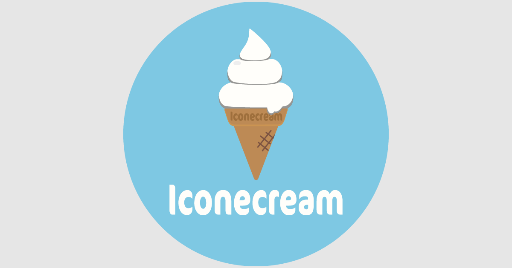

# Iconecream

> カラーを選ぶだけ。アイスクリームのアイコン画像メーカー

[](https://giana12th.github.io/iconecream/)

**[Demo](https://giana12th.github.io/iconecream/)**

## 機能

- アイスの色・背景色をカラーピッカーで自由にカスタマイズ
- リアルタイムプレビュー
- JPG画像としてダウンロード（128〜1024pxの4サイズ）
- 5種類のプリセットカラーからランダム選択

## 技術スタック

Bun / Vite / React / TypeScript / Claude Code

## 開発

```sh
bun install
bun dev
bun lint
bun build
```

## デプロイ

GitHub Actions による GitHub Pages への自動デプロイ（mainブランチへのpush時）

## ブログ

- [Iconecream: ブラウザAPIだけで作るアイコン画像ジェネレーター](blog/iconecream-tech-blog.md)

## ライセンス

MIT
